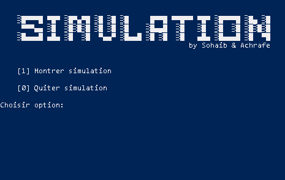

# Simulateur de réseau électrique 
### Projet POO
    - Fait par:
    - Achrafe BEN AMMI 17190
    - Sohaib EL AMIRI CHARIF 17049

L'énoncé du projet est disponible sur ce [lien](https://quentin.lurkin.xyz/courses/poo/projet2020/)

# Introduction 

Pour pouvoir effectuer des recherches, on souhaite disposer d'une plateforme de simulation de réseau électrique à l'échelle d'un pays. Le but est de pouvoir simuler le comportement dynamique d'un ensemble de centre de production d'électricité et d'un ensemble de consommateurs d'énergie électrique. Grâce à cette plateforme les chercheurs pourront développer des systèmes de régulation automatique du réseau, faire des simulations de catastrophe, optimiser les achats et reventes d'énergie électrique à l'étranger, étudier les possibilités d'investissements et optimiser l'impact environnemental.

# Utilisation

- Cloner ou télécharger le repository
- Lancer le fichier *Interface.py*
- Choisir l'option 1 pour lancer la simulation
-  
- La simulation affiche les différentes données qui sont mises à jour automatiquement chaque seconde. 
- Les messages d'alerte sont affichés lorsqu'il y a différents problèmes dans la simulation (surproduction, sousproduction,etc)

## Ajout de données 

Les chercheurs peuvent rajouter des données manuelement en les insérant dans le fichier *Utils.py* dans la section prévue.

## Documents techniques 

- Le diagramme de classes et disponible [ici](https://github.com/sohaeac/Simulation_Reseau_Electrique-/blob/master/img/Diagramme_classes.png).
- Le diagramme de séquences est disponible [ici](https://github.com/sohaeac/Simulation_Reseau_Electrique-/blob/master/img/Diagramme_sequence.png).
